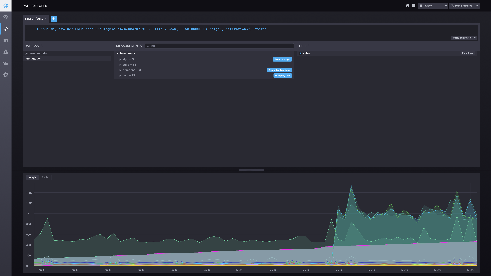

== View Benchmark Results as graph over time

=== Dump benchmark results to https://github.com/influxdata/influxdb[influx db]

If you haven't already, create a new influx database

[source,bash]
----
curl -i -XPOST http://localhost:8086/query --data-urlencode "q=CREATE DATABASE neo"
----

Run python (2.7) script to generate https://docs.influxdata.com/influxdb/v1.2/guides/writing_data/[line protocol data]

[source,bash]
----
python benchmarks_to_influx.py > benchmark_inputs.txt
----

Import data to influx db

[source,bash]
----
curl -i -XPOST 'http://localhost:8086/write?db=neo' --data-binary @benchmark_inputs.txt
----

=== View the results

Install https://github.com/influxdata/chronograf[Chronograf], point it to you influx db

Open the Data Explorer and run a https://docs.influxdata.com/influxdb/v1.2/query_language/data_exploration/[query] like

[source,sql]
----
SELECT "value", "build" FROM "neo"."autogen"."benchmark" WHERE time > now() - 5m GROUP BY "algo", "iterations", "test"
----

[NOTE]
The timestamp is fake; every benchmark is a second-wide tick leading to `now`, which is the moment of running the python script.
If you want to know when a certain regression has happened, go to the Table View and look fot the build number – those are travis builds.

=== Example

