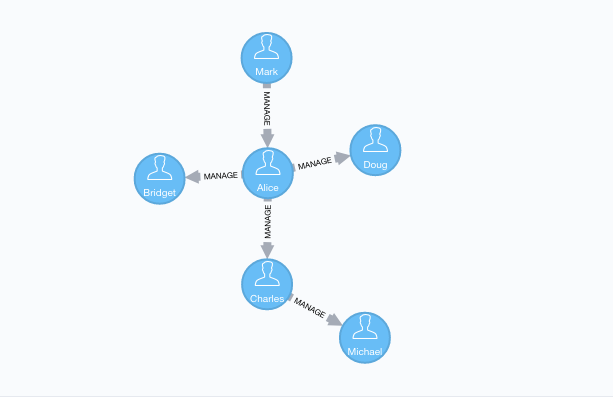

[[algorithms-betweenness-centrality]]
= The Betweenness Centrality algorithm

[abstract]
--
This section describes the Betweenness Centrality algorithm in the Neo4j Graph Algorithms library.
--

// tag::introduction-start[]
Betweenness centrality is a way of detecting the amount of influence a node has over the flow of information in a graph.
It is often used to find nodes that serve as a bridge from one part of a graph to another.

In the following example, Alice is the main connection in the graph:
// end::introduction-start[]

// tag::introduction-end[]
If Alice is removed, all connections in the graph would be cut off.
This makes Alice important, because she ensures that no nodes are isolated.
// end::introduction-end[]

This section includes:

* <<algorithms-betweenness-centrality-context, History and explanation>>
* <<algorithms-betweenness-centrality-usecase, Use-cases - when to use the Betweenness Centrality algorithm>>
* <<algorithms-betweenness-centrality-limitations, Constraints - when not to use the Betweenness Centrality algorithm>>
* <<algorithms-betweenness-centrality-sample, Betweenness Centrality algorithm sample>>
* <<algorithms-betweenness-centrality-approx, Approximation of Betweenness Centrality>>
** <<algorithms-betweenness-centrality-ra_brandes, RA-Brandes algorithm>>
* <<algorithms-betweenness-centrality-syntax, Syntax>>
* <<algorithms-betweenness-centrality-cp, Cypher projection>>
* <<algorithms-betweenness-centrality-support, Graph type support>>
* <<algorithms-betweenness-centrality-imp, Implementations>>

[[algorithms-betweenness-centrality-context]]
== History and explanation

// tag::explanation[]
The Betweenness Centrality algorithm calculates the shortest (weighted) path between every pair of nodes in a connected graph, using the breadth-first search algorithm.
Each node receives a score, based on the number of these shortest paths that pass through the node.
Nodes that most frequently lie on these shortest paths will have a higher betweenness centrality score.

The algorithm was given its first formal definition by Linton Freeman, in his 1971 paper http://moreno.ss.uci.edu/23.pdf["A Set of Measures of Centrality Based on Betweenness"^].
It was considered to be one of the "three distinct intuitive conceptions of centrality".
// end::explanation[]

[[algorithms-betweenness-centrality-usecase]]
== Use-cases - when to use the Betweenness Centrality algorithm

// tag::use-case[]

* Betweenness centrality is used to research the network flow in a package delivery process, or telecommunications network.
  These networks are characterized by traffic that has a known target and takes the shortest path possible.
  This, and other scenarios, are described by Stephen P. Borgatti in http://www.analytictech.com/borgatti/papers/centflow.pdf["Centrality and network flow"].

* Betweenness centrality is used to identify influencers in legitimate, or criminal, organizations.
  Studies show that influencers in organizations are not necessarily in management positions, but instead can be found in brokerage positions of the organizational network.
  Removal of such influencers could seriously destabilize the organization.
  More detail can be found in http://archives.cerium.ca/IMG/pdf/Morselli_and_Roy_2008_.pdf["Brokerage qualifications in ringing operations"], by Carlo Morselli and Julie Roy.

* Betweenness centrality can be used to help microbloggers spread their reach on Twitter, with a recommendation engine that targets influencers that they should interact with in the future.
  This approach is described in ftp://ftp.umiacs.umd.edu/incoming/louiqa/PUB2012/RecMB.pdf["Making Recommendations in a Microblog to Improve the Impact of a Focal User"].
// end::use-case[]

[[algorithms-betweenness-centrality-limitations]]
== Constraints - when not to use the Betweenness Centrality algorithm

// tag::constraint[]
* Betweeness centrality makes the assumption that all communication between nodes happens along the shortest path and with the same frequency, which isn't the case in real life.
  Therefore, it doesn't give us a perfect view of the most influential nodes in a graph, but rather a good representation.
  Newman explains this in more detail on page 186 of https://global.oup.com/academic/product/networks-9780199206650?cc=us&lang=en&[Networks: An Introduction^].

* For large graphs, exact centrality computation isn't practical.
  The fastest known algorithm for exactly computing betweenness of all the nodes requires at least `O(nm)` time for unweighted graphs, where `n` is the number of nodes and `m` is the number of relationships.
  Instead, we can use an approximation algorithm that works with a subset of nodes.
// end::constraint[]

[[algorithms-betweenness-centrality-sample]]
== Betweenness Centrality algorithm sample

People with high betweenness tend to be the innovators and brokers in social networks.
They combine different perspectives, transfer ideas between groups, and get power from their ability to make introductions and pull strings.

.The following will create a sample graph:
[source, cypher]
----
include::scripts/betweenness-centrality.cypher[tag=create-sample-graph]
----

.The following will run the algorithm and stream results:
[source, cypher]
----
include::scripts/betweenness-centrality.cypher[tag=stream-sample-graph]
----

.The following will run the algorithm and write back results:
[source, cypher]
----
include::scripts/betweenness-centrality.cypher[tag=write-sample-graph]
----

// tag::stream-sample-graph-result[]
.Results
[opts="header", cols="1,1"]
|===
| Name    | Centrality weight
| Alice   | 4
| Charles | 2
| Bridget | 0
| Michael | 0
| Doug    | 0
| Mark    | 0
|===
// end::stream-sample-graph-result[]

// tag::stream-sample-graph-explanation[]
We can see that Alice is the main broker in this network, and Charles is a minor broker.
The others don't have any influence, because all the shortest paths between pairs of people go via Alice or Charles.
// end::stream-sample-graph-explanation[]

include::betweenness-centrality-ra-brandes.adoc[leveloffset=3]

[[algorithms-betweenness-centrality-cp]]
== Cypher projection

include::projected-graph-model/cypher-projection.adoc[tag=explanation]

.Set `graph:'cypher'` in the config:

[source, cypher]
----
include::scripts/betweenness-centrality.cypher[tag=cypher-loading]
----

[[algorithms-betweenness-centrality-support]]
== Graph type support

The Betweenness Centrality algorithm supports the following graph types:

* [x] directed, unweighted

** loading incoming relationships: 'INCOMING','IN','I' or '<'
** loading outgoing relationships: 'OUTGOING','OUT','O' or '>'

* [ ] directed, weighted

* [x] undirected, unweighted

** direction:'both' or '<>'

* [ ] undirected, weighted

[[algorithms-betweenness-centrality-imp]]
== Implementations

`algo.betweenness()`

* Implementation of brandes-bc algorithm and nodePartitioning extension.
* If concurrency parameter is set (and >1), ParallelBetweennessCentrality is used.
* ParallelBC spawns N(given by the concurrency param) concurrent threads for calculation, where each one
 calculates the BC for one node at a time.

`algo.betweenness.exp1()`

* Brandes-like algorithm, which uses successor sets instead of predecessor sets.
* The algorithm is based on Brandes definition, but with some changes regarding the dependency-accumulation step.
* Does not support undirected graph

`algo.betweenness.sampled()`

* Calculates betweenness-dependencies on a subset of pivot nodes (instead of all nodes).
2 randomization strategies are implemented, which can be set using the optional argument strategy: `random selection(default): strategy:'random':` (takes optional argument probability:double(0-1) or log10(N) / e^2 as default)
* Degree based randomization: `strategy:'degree':` (makes dense nodes more likely)
* Optional Arguments: `maxDepth:int`

ifndef::env-docs[]

== References

// tag::references[]

* http://cass-mt.pnnl.gov/docs/pubs/georgiatechlbnlpnnlfastbc-mtaap2009.pdf

* http://www.algo.uni-konstanz.de/publications/b-fabc-01.pdf

* https://www.sci.unich.it/~francesc/teaching/network/betweeness.html

* https://en.wikipedia.org/wiki/Centrality

* https://en.wikipedia.org/wiki/Betweenness_centrality

* http://www.fmsasg.com/SocialNetworkAnalysis/

* https://econsultancy.com/blog/63682-twitter-network-analysis-identifying-influencers-and-innovators/

* http://iima.org/wp/wp-content/uploads/2017/04/Curriculum-Structure-and-Assessment-Placement_Lightfoot.pdf

* [1] https://arxiv.org/pdf/1702.06087.pdf

* [2] https://www.cc.gatech.edu/~mihail/WAW07.pdf

* [3] https://pdfs.semanticscholar.org/2e0d/94d072d79ba73c9a153a228b93520b3ce670.pdf

* [4] https://global.oup.com/academic/product/networks-9780199206650?cc=us&lang=en&[Newman, Mark. Networks: An Introduction (Page 186). OUP Oxford.^]

// end::references[]
endif::env-docs[]

ifdef::implementation[]
// tag::implementation[]

== Implementation details

:leveloffset: +1
// copied from: https://github.com/neo4j-contrib/neo4j-graph-algorithms/issues/98

In graph theory, betweenness centrality is a measure of centrality in a graph based on shortest paths. For every pair of nodes in a connected graph, there exists at least one shortest path between the nodes such that either the number of relationships that the path passes through (for unweighted graphs) or the sum of the weights of the relationships (for weighted graphs) is minimized. The betweenness centrality for each vertex is the number of these shortest paths that pass through the vertex.

## Progress

- [x] adapt apoc-procedure to algorithm-api
- [x] implement procedure
- [x] tests
- [x] relationship case tests
- [x] simple benchmark
- [x] benchmark on bigger graphs
- [x] parallelization
- [x] evaluation
- [x] documentation

== Details

=== algo.betweenness

- implementation of brandes-bc algorithm and nodePartitioning extension
- http://www.algo.uni-konstanz.de/publications/b-fabc-01.pdf
- if `concurrency` parameter is set (and >1) ParallelBetweennessCentrality is used
- ParallelBC spawns N(given by the concurrency param) concurrent threads for calculation where each one
 calculates the BC for one node at a time

=== algo.betweenness.exp1

- brandes-like algorithm which uses successor sets instead of predecessor sets
- The algorithm is based on Brandes definition but with some changes
 regarding the dependency-accumulation step.
- http://cass-mt.pnnl.gov/docs/pubs/georgiatechlbnlpnnlfastbc-mtaap2009.pdf

=== algo.betweenness.sampled.*

- Calculates betweenness-dependencies on a subset of pivot nodes (instead of all nodes). Up to now 2 randomization strategies are implemented which can be set using the optional argument strategy:

- random selection(default): strategy:'random': (takes optional argument probability:double(0-1) or log10(N) / e^2 as default)
- degree based randomization: strategy:'degree': (makes dense nodes more likely)
- optional Arguments: maxDepth:int

// end::implementation[]
endif::implementation[]
