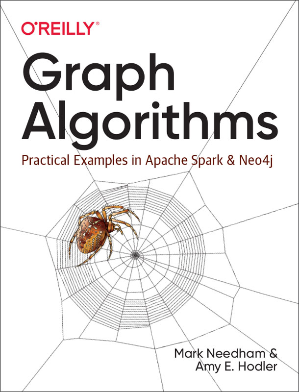

= Efficient Graph Algorithms for Neo4j

This libray has been deprecated by the Graph Data Science (GDS) library, now available on our  https://neo4j.com/download-center/[download center^] or via our github repo at https://github.com/neo4j/graph-data-science/. 

This is an update to the graph algorithms library, featuring all of your favorite graph algorithms - and some new ones - plus a new, unified and simplified surface, improvements to the graph loaders, better error messaging, and additional features and workflows to support production scale deployments.

Documentation for the Graph Data Science Library is available here: https://neo4j.com/docs/graph-data-science/current/

**please enter all github issues on the https://github.com/neo4j/graph-data-science/issues[new repo]**

== Graph Algorithms Book

Amy Hodler and Mark Needham recently finished writing the O'Reilly Graph Algorithms Book. For a limited time only, you can **download your free copy** from https://neo4j.com/graph-algorithms-book/[neo4j.com/graph-algorithms-book^]

